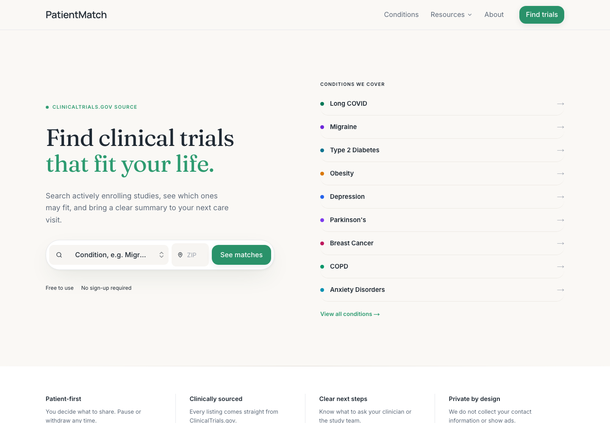
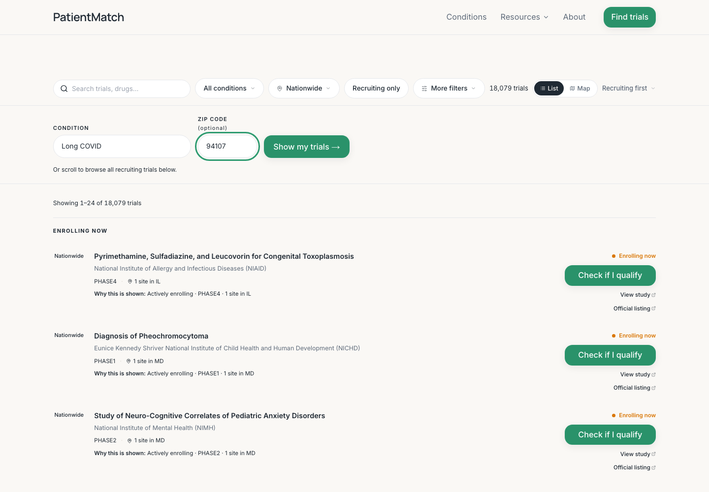
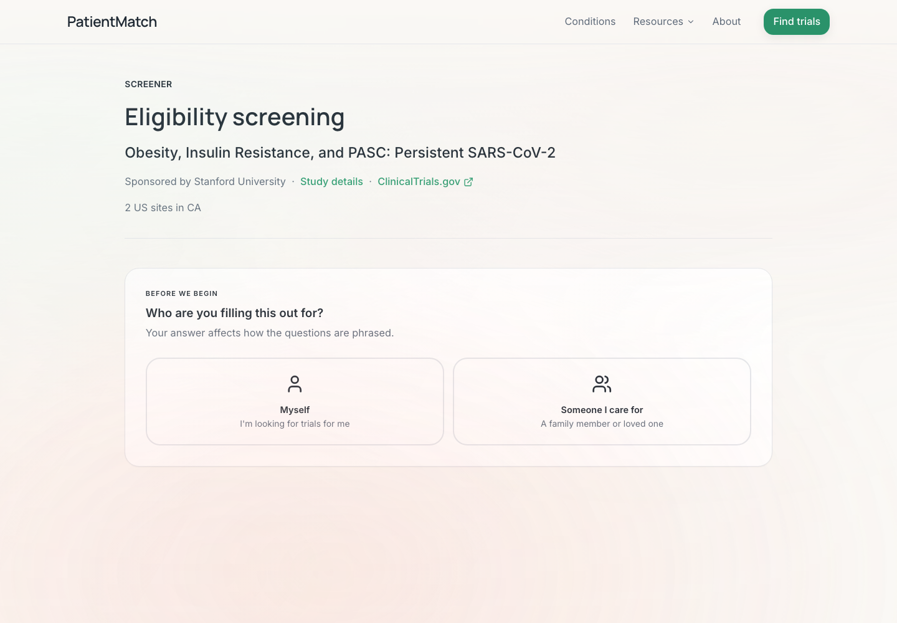
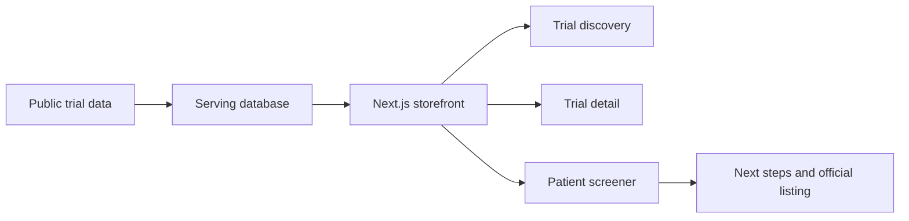

# PatientMatch

[](LICENSE)
[](https://github.com/pramosferrer/patientmatch-v0/actions/workflows/ci.yml)
[](https://nextjs.org/)
[](https://www.typescriptlang.org/)

PatientMatch is an open-source clinical trial discovery storefront that helps patients and caregivers understand nearby trial options, screening questions, and next steps using public trial data.

Live site: https://patientmatch.health

## Screenshots

The current public flow starts from condition search, narrows trial discovery with location, and links into a trial-specific screener.

| Home | Discovery | Screener |
| --- | --- | --- |
|  |  |  |

## Why This Matters

Clinical trial registries are public, but they are difficult for many patients to interpret. Eligibility criteria, site locations, recruitment status, and next steps are often spread across dense records that are hard to scan.

PatientMatch focuses on the patient-facing layer: trial browsing, proximity-aware discovery, structured screening questions, privacy-conscious profile handling, and reusable UI patterns that patient advocacy groups, clinics, researchers, and developers can inspect and adapt.

PatientMatch is early-stage open-source software. It is not a medical device and does not provide medical advice, diagnosis, treatment, enrollment guarantees, or eligibility determinations. Trial teams and clinicians make final eligibility decisions.

## What PatientMatch Provides

- Trial discovery by condition and location.
- A match profile that carries global intake fields across lists, detail pages, and screeners.
- Patient-readable trial cards and next-step prompts.
- Structured questionnaire rendering from `questionnaire_json`.
- Deduplication of globally known questions such as age, sex at birth, ZIP, and diagnosis confirmation.
- A storefront runtime that avoids service-role database access.

## Architecture

PatientMatch is a Next.js App Router storefront backed by Supabase as the serving database.



Core runtime boundaries:

- `app/` - Next.js App Router pages and route handlers.
- `components/` - Patient-facing UI components.
- `lib/` - URL helpers, Supabase clients, matching utilities, and adapters.
- `shared/` - Shared condition catalog and profile helpers.
- `supabase/migrations/` - Versioned serving-layer schema changes.
- `docs/` - Public architecture and serving-contract documentation.

The storefront reads public trial and questionnaire data from Supabase with anon/RLS access. Data ingestion, registry refreshes, and service-role writes are intentionally outside this public storefront runtime.

More detail:

- `docs/architecture.md`
- `docs/serving_contract.md`
- `docs/public-interest.md`

## Privacy and Safety

PatientMatch is built to minimize sensitive data exposure:

- No Supabase service-role key is required for normal storefront runtime.
- Browser clients use anon credentials only.
- Server reads use anon Supabase access and public RPC/view contracts.
- Match-profile context is limited to non-contact fields such as condition, ZIP, age, sex, and radius.
- Screener answers and profile fields should not be logged in production paths.
- Authenticated saved-trial/profile writes are expected to use user-scoped RLS.

Do not put secrets in `NEXT_PUBLIC_*` variables. Do not file GitHub issues containing personal health information, contact details, screener answers, ZIP codes, or other sensitive personal data.

See `docs/privacy-model.md` for the project privacy model.

## Local Development

Requirements:

- Node.js `>=20.11.0 <21`
- npm `>=10.2.0`
- Supabase project or compatible synthetic serving data

Setup:

```bash
npm install
cp .env.example .env.local
npm run dev
```

Open http://localhost:3000.

Synthetic fixtures are available in `fixtures/demo/`; see `docs/demo-data.md`.

Useful commands:

```bash
npm run lint
npm run test:unit
npm run demo:check
npm run build
npm run test:e2e
```

For local builds, set `PII_SECRET` to a random value of at least 32 characters.

## Environment Variables

```bash
NEXT_PUBLIC_SUPABASE_URL=
NEXT_PUBLIC_SUPABASE_ANON_KEY=
SUPABASE_URL=
SUPABASE_ANON_KEY=
PII_SECRET=
```

The public storefront does not require `SUPABASE_SERVICE_ROLE_KEY`.

## Public Serving Contract

The frontend expects a serving layer with public trial and site data:

- `public.trials`
- `public.trial_sites`
- `public.zip_centroids`

See `docs/serving_contract.md` for the current public contract.

## Contributing

Useful contribution areas include:

- Accessibility improvements for patient-facing flows.
- Trial-card and screener UX improvements.
- Tests for questionnaire rendering and profile deduplication.
- Public documentation and setup improvements.
- Safer privacy/security defaults.
- Additional condition-page polish and patient education content.
- Synthetic demo data and local setup improvements.

Read `CONTRIBUTING.md` before opening a pull request.

Please also read `CODE_OF_CONDUCT.md`. Public GitHub issues must use synthetic examples only and must not contain personal health information.

Maintainer expectations are documented in `MAINTAINERS.md`.

Planned work is tracked in `ROADMAP.md`.

## Security

Please read `SECURITY.md` before reporting security issues. Do not disclose vulnerabilities or personal health information in public issues.

## License

Apache License 2.0. See `LICENSE`.
