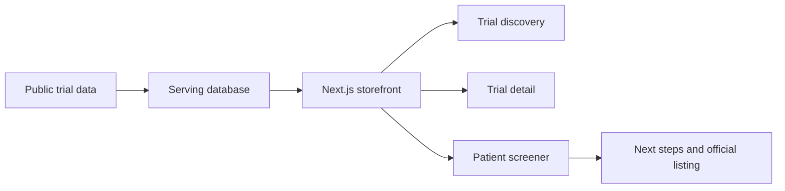

# PatientMatch

PatientMatch is an open-source patient-facing clinical trial discovery frontend. It helps patients and caregivers browse public trial listings, understand why a study may be relevant, and walk through privacy-conscious screening questions before reviewing next steps.

The project is designed as reusable public-good infrastructure for clinical trial access. It focuses on transparent trial cards, proximity-aware discovery, structured questionnaire rendering, and a storefront runtime that avoids service-role database access.

Live site: https://patientmatch.health

## What It Does

- Browse clinical trials by condition and location.
- Preserve a match profile across trial lists, detail pages, and screeners.
- Render structured trial questionnaires from `questionnaire_json`.
- Remove globally known questions such as age, sex at birth, ZIP, and diagnosis confirmation from trial-specific screeners.
- Explain why a trial is shown using available signals such as condition match, location, recruitment status, phase, and site count.
- Point patients toward official ClinicalTrials.gov listings and doctor-facing next steps.

PatientMatch is not a medical device and does not provide medical advice, diagnosis, treatment, enrollment guarantees, or eligibility determinations. Trial teams and clinicians make final eligibility decisions.

## Why This Matters

Clinical trial discovery is a public-good problem. Raw registries are difficult for many patients to interpret, and eligibility criteria often hide the practical questions patients care about: whether a study is recruiting, where sites are located, whether their age or sex appears to fit, and what to ask a doctor next.

This repository aims to make those workflows easier to inspect, reuse, and improve in public.

## Architecture

PatientMatch is a Next.js App Router storefront backed by Supabase as the serving database.



Core runtime boundaries:

- `app/` - Next.js App Router pages and route handlers.
- `components/` - Patient-facing UI components.
- `lib/` - URL helpers, Supabase clients, matching utilities, and adapters.
- `shared/` - Shared condition catalog and profile helpers.
- `supabase/migrations/` - Versioned serving-layer schema changes.
- `docs/` - Public architecture and serving-contract documentation.

The storefront reads public trial and questionnaire data from Supabase with anon/RLS access. Data ingestion, registry refreshes, and service-role writes are intentionally outside this public storefront runtime.

## Privacy Posture

PatientMatch is built to minimize sensitive data exposure:

- No Supabase service-role key is required for normal storefront runtime.
- Browser clients use anon credentials only.
- Server reads use anon Supabase access and public RPC/view contracts.
- Match-profile context is limited to non-contact fields such as condition, ZIP, age, sex, and radius.
- Screener answers and profile fields should not be logged in production paths.
- Authenticated saved-trial/profile writes are expected to use user-scoped RLS.

Do not put secrets in `NEXT_PUBLIC_*` variables. Do not file GitHub issues containing personal health information, contact details, screener answers, ZIP codes, or other sensitive personal data.

## Local Development

Requirements:

- Node.js `>=20.11.0 <21`
- npm `>=10.2.0`
- Supabase project or compatible local serving data

Setup:

```bash
npm install
cp .env.example .env.local
npm run dev
```

Open http://localhost:3000.

Useful commands:

```bash
npm run lint
npm run build
npm run test:e2e
```

For local builds, set `PII_SECRET` to a random value of at least 32 characters.

## Environment Variables

```bash
NEXT_PUBLIC_SUPABASE_URL=
NEXT_PUBLIC_SUPABASE_ANON_KEY=
SUPABASE_URL=
SUPABASE_ANON_KEY=
PII_SECRET=
```

The public storefront does not require `SUPABASE_SERVICE_ROLE_KEY`.

## Public Serving Contract

The frontend expects a serving layer with public trial and site data:

- `public.trials`
- `public.trial_sites`
- `public.zip_centroids`

See `docs/serving_contract.md` for the current public contract.

## Contributing

Useful contribution areas include:

- Accessibility improvements for patient-facing flows.
- Trial-card and screener UX improvements.
- Tests for questionnaire rendering and profile deduplication.
- Public documentation and setup improvements.
- Safer privacy/security defaults.
- Additional condition-page polish and patient education content.

Read `CONTRIBUTING.md` before opening a pull request.

## Security

Please read `SECURITY.md` before reporting security issues. Do not disclose vulnerabilities or personal health information in public issues.

## License

Apache License 2.0. See `LICENSE`.
