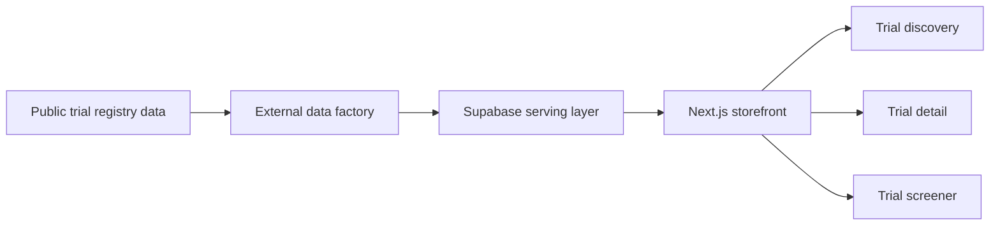

# Architecture

PatientMatch is a Next.js App Router storefront backed by Supabase serving data.

## Runtime Boundary

The storefront is responsible for:

- Patient-facing pages and route handlers in `app/`.
- Trial cards, filters, maps, screeners, and shared UI in `components/`.
- Supabase anon clients, URL helpers, matching utilities, and PMQ adapters in `lib/`.
- Shared profile and condition utilities in `shared/`.

The storefront is not responsible for:

- ClinicalTrials.gov or AACT ingestion.
- Criteria parsing.
- PMQ/questionnaire generation.
- Service-role writes to Supabase.
- Private data-pipeline operations.

## Serving Layer

The storefront reads from Supabase tables and RPCs documented in `docs/serving_contract.md`.

Core public tables:

- `public.trials`
- `public.trial_sites`
- `public.zip_centroids`

The browser client uses anon credentials. Server routes use anon Supabase access and public RLS/RPC contracts. `SUPABASE_SERVICE_ROLE_KEY` is not required for storefront runtime.

## Questionnaire Rendering

Trial screeners use the direct-injection pattern:

1. The trial page fetches `questionnaire_json` for a specific `nct_id`.
2. `lib/pmqAdapter.ts` converts the PMQ payload to `UiQuestion[]`.
3. Global match-profile answers such as age, sex at birth, ZIP, and diagnosis confirmation are deduplicated.
4. `components/Screener.tsx` renders the calculated questions.

New trial-specific questionnaire work should use `questionnaire_json`. `criteria_json` is deprecated for new features.
