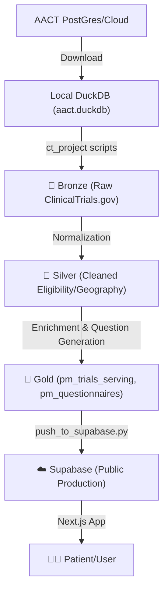

# PatientMatch Data Pipeline Architecture

This document clarifies the layers of the data pipeline and how to keep information consistent across the clinical trial database and the frontend application.

## 🏗️ The Layers



### 1. Local Warehouse (`ct_project/db/aact.duckdb`)
*   **Purpose**: Heavy data processing and clinical question generation.
*   **Why?**: Generating 20,000+ smart questionnaires takes dozens of hours via LLM (or complex regex) and would be too slow/expensive to do in the cloud.
*   **Gold View**: `gold.pm_trials_serving` is the curated set of trials that meet our quality/readiness bars.

### 2. Production Cloud (Supabase)
*   **Purpose**: Serves the frontend ultra-fast.
*   **Connection**: Linked by `nct_id`.
*   **Source of Truth**: The `trials` table in Supabase contains the `questionnaire_json` produced by the local pipeline.

## 🔄 Consistency Checklist

Whenever you update clinical logic or question rules in `ct_project`, follow this "Ritual":

1.  **Rebuild Questionnaires**:
    ```bash
    # Run from ct_project
    python scripts/build_pm_questionnaires.py --pipeline-version pmq_vXX --limit 1000
    ```
2.  **Push to Supabase**:
    ```bash
    # Run from ct_project
    python scripts/push_to_supabase.py --build_tag pmq_vXX --limit 25000
    ```
3.  **Verify Frontend**:
    Check a few NCT IDs on `localhost:3000` to ensure the new version is live.

## 📍 Site Count Nuances
*   **DuckDB (1.4M sites)**: Includes sites for *all* 400k+ global trials.
*   **Serving Dataset (153k sites)**: Only includes sites for the ~22k trials we have vetted and marked as "Ready".
*   **Supabase (Limit 50/100)**: By default, we push the top 50 (now 100) sites per trial to keep query speed high.

## 📝 Troubleshooting Versions
Each questionnaire in Supabase has a `pipeline_version` field. If you see old logic, it means the trial hasn't been pushed with the latest `--build_tag` yet.
